## 🌐 Node-RED Setup for Monitoring, Control, and Cloud Operations

### 🔹 About Node-RED

Node-RED is a powerful **low-code programming tool** for wiring together **hardware devices, APIs, and online services**. It enables users to **collect, transform, and visualize data** through simple, browser-based flows.

Built on **Node.js**, Node-RED is event-driven and lightweight—ideal for real-time control systems, edge computing on devices like Raspberry Pi, or even cloud-based automation.

---

### ✅ Running Node-RED on Windows

This guide explains how to install and run Node-RED in a **Windows 10/11 environment**. PowerShell is recommended over `cmd` for better compatibility with Unix-style commands.

---

### ⚙️ Step-by-Step Instructions

#### 🟢 1. Install Node.js

- Download the latest **LTS (Long-Term Support)** version from:
  👉 [https://nodejs.org/en/download](https://nodejs.org/en/download)

- Run the `.msi` installer with **administrator privileges** and accept all default settings.

- After installation, open **PowerShell** or **Command Prompt** and verify installation:

```powershell
node --version; npm --version
````

Expected output:

```
v18.15.0
9.5.0
```

---

#### 🔴 2. Install Node-RED Globally

Install Node-RED as a global npm module:

```bash
npm install -g --unsafe-perm node-red
```

This command adds the `node-red` command to your system path.

---

#### 🚀 3. Run Node-RED

Once installed, launch Node-RED by running:

```bash
node-red
```

You should see terminal output indicating the server is running, ending with something like:

```
Server now running at http://127.0.0.1:1880/
```

Open a browser and navigate to:
📍 `http://localhost:1880`

This opens the **Node-RED Flow Editor**.

---

### 📊 Use Cases in This Workshop

Node-RED will be used to:

* **Monitor**: Display real-time temperature and humidity readings from ESP32.
* **Control**: Send MQTT messages to ESP32 to turn the LED on/off.
* **Cloud Operations**: Forward sensor data to online platforms or dashboards.

---

### 📁 Next Steps

You can now:

* Create **MQTT input/output nodes**
* Use **dashboard UI nodes** for visualization
* Connect to your **local Mosquitto broker (port 1883)**

Example:

* MQTT Broker: `192.168.137.1`
* Port: `1883`
* Topic: `Group.DHT` (subscribe)
* Topic: `Group.LED` (publish)


---
---

### 🔧 Configuring MQTT Broker in Node-RED

Set up your MQTT Broker using the following settings:

- **Server**: `192.168.137.1`
- **Port**: `1883`
- **Authentication**: I have initially added username as `mqttuser` and password as `1234` under the `Security` tab. You can set yours

#### 📡 MQTT Broker Connection Settings

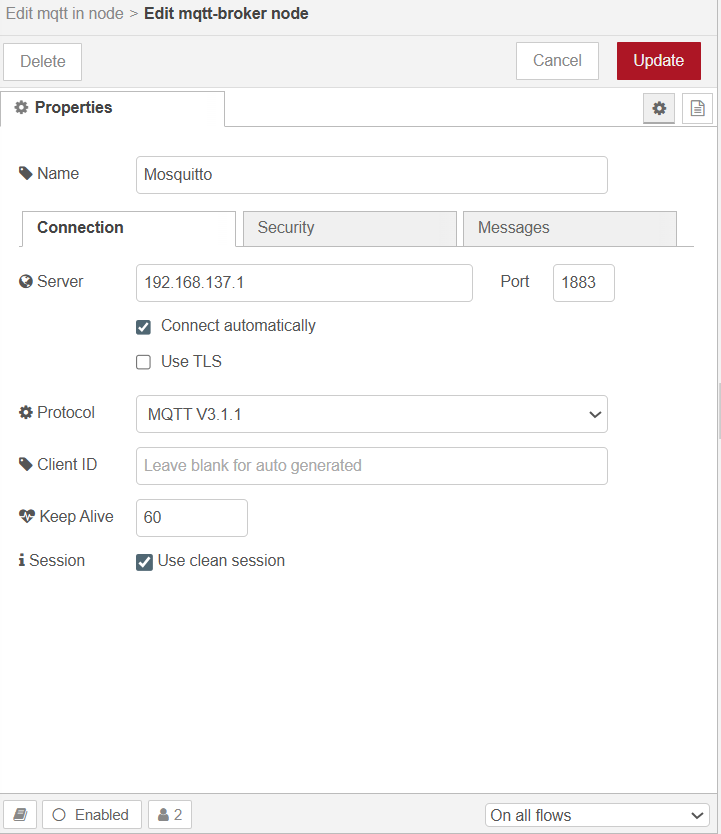

#### 🔒 MQTT Broker Security Settings

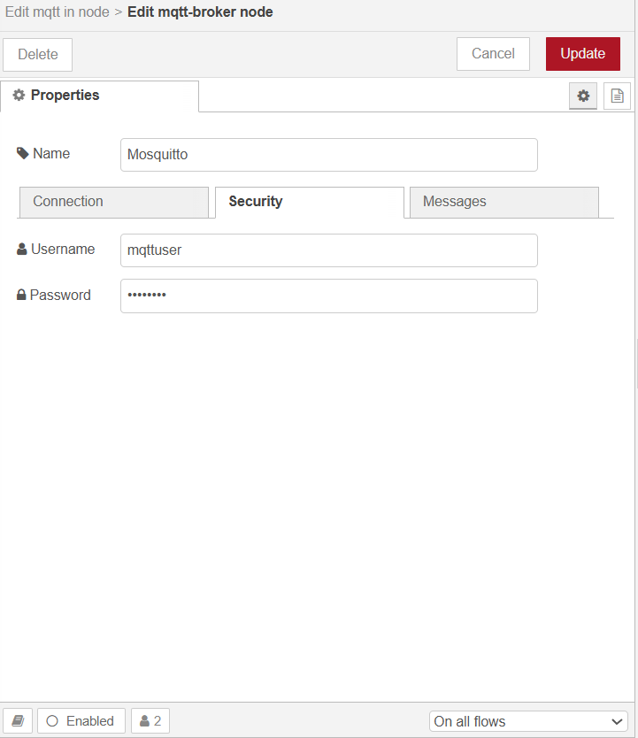


---
### 🌡️ Receiving Sensor Data via MQTT In Node

To read real-time **Temperature and Humidity** data from the **DHT22 sensor** (connected to ESP32 FireBeetle), configure a **`mqtt in` node** in Node-RED.

This node will **subscribe** to the topic published by the ESP32 device using the Mosquitto broker.


#### 🛠 Configuration Details:

- **Server**: `Mosquitto` (pre-configured in earlier steps)
- **Action**: `Subscribe to single topic`
- **Topic**: `Tutor.DHT`
- **QoS**: `0` (default)
- **Output**: `auto-detect (parsed JSON)`
- **Name**: `Tutor.DHT`

> 📌 This setup allows Node-RED to parse JSON data like:
> ```json
> {
>   "DT": "2025-07-15 10:42:31",
>   "T": 28.54,
>   "H": 65.32
> }
> ```

#### 📷 MQTT In Node Configuration

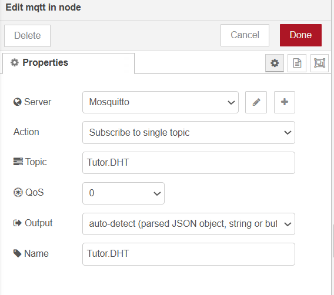


---
### 🧩 Installing the Node-RED Dashboard Palette

To visualize sensor readings and implement control elements like buttons and gauges, install the **Node-RED Dashboard** nodes.

These nodes allow you to create interactive web-based dashboards from your Node-RED flows.

#### 🛠 Installation Steps:

1. Open Node-RED in your browser (`http://localhost:1880`)
2. Click the menu (☰) → **Manage palette**
3. Go to the **Install** tab
4. Search for: `dashboard`
5. Find `node-red-dashboard` and click **Install**

> 🔗 This package provides UI elements such as charts, gauges, switches, and text output blocks for building custom dashboards.

#### 📷 Dashboard Palette Installation View

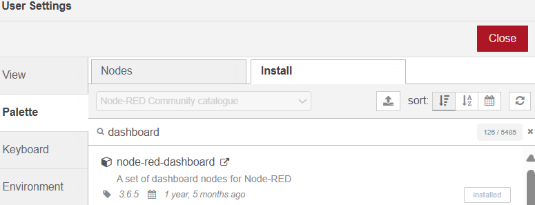


---


### 🧮 Extracting Sensor Values with Function Nodes

When the MQTT `Tutor.DHT` topic sends data in JSON format such as:

```json
{
  "DT": "2025-07-15 10:42:31",
  "T": 28.54,
  "H": 65.32
}
````

We can isolate each property using **Function nodes** in Node-RED. This enables further routing, display, or processing of **individual values**.


#### 🕒 Filter Timestamp (DT)

Use the following function to extract the `DT` value:

```javascript
msg.payload = msg.payload.DT;
return msg;
```

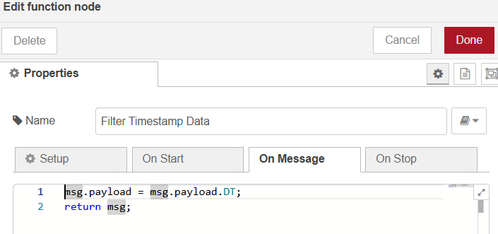


#### 🌡️ Filter Temperature (T)

Use the following function to extract the `T` value:

```javascript
msg.payload = msg.payload.T;
return msg;
```

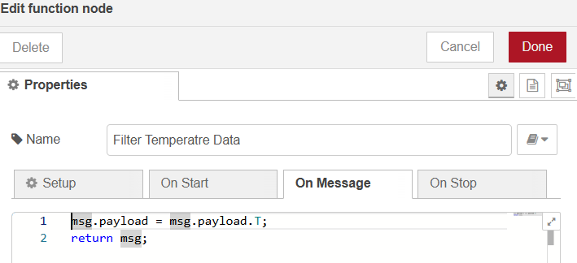


#### 💧 Filter Humidity (H)

Use the following function to extract the `H` value:

```javascript
msg.payload = msg.payload.H;
return msg;
```

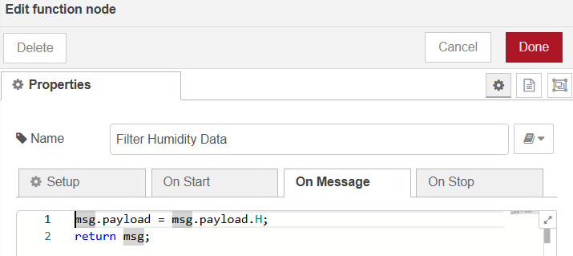


> ✅ You can now connect each of these function nodes to separate **UI elements** (e.g., `ui_text`, `ui_gauge`, or `ui_chart`) in your Node-RED dashboard for real-time visualization.


---

## 📊 Building a Real-Time Sensor Dashboard in Node-RED

Once MQTT data is filtered using function nodes, you can visualize it on a web-based dashboard using **Node-RED Dashboard** widgets like `ui_text`, `ui_gauge`, and `ui_chart`.


### 🕒 1. Display Timestamp with Text Node

- **Widget**: `ui_text`
- **Group**: `[Workshop] Timestamp`
- **Label**: `Date-Time:`
- **Value format**: `{{msg.payload}}`

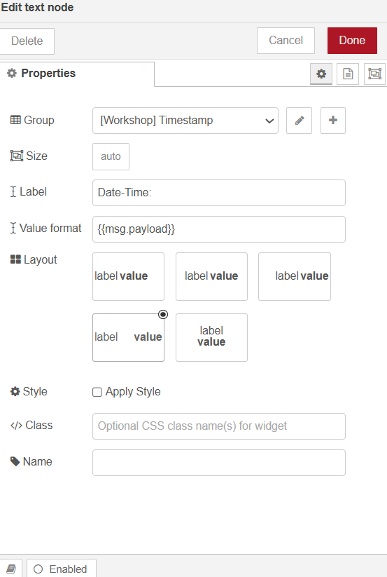


### 🌡️ 2. Temperature Gauge

- **Widget**: `ui_gauge`
- **Group**: `[Workshop] Temperature`
- **Type**: `Level`
- **Units**: `°C`
- **Range**: 0 to 40
- **Value format**: `{{msg.payload}}`

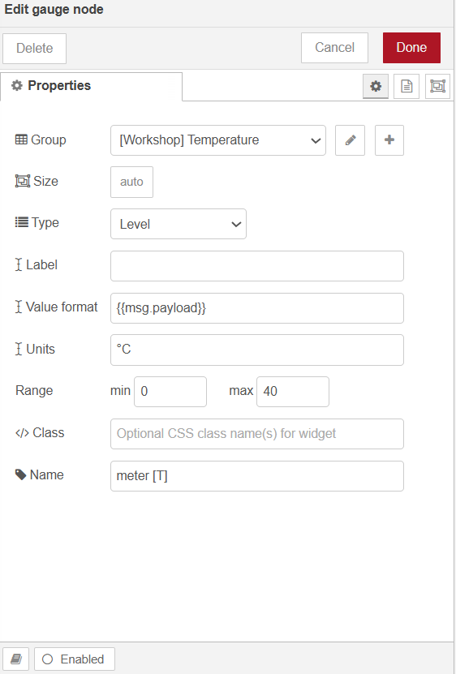


### 📈 3. Temperature Chart

- **Widget**: `ui_chart`
- **Group**: `[Workshop] Temperature`
- **Type**: `Line chart`
- **X-axis**: `last 1 hour`
- **Y-axis Range**: 0 to 40

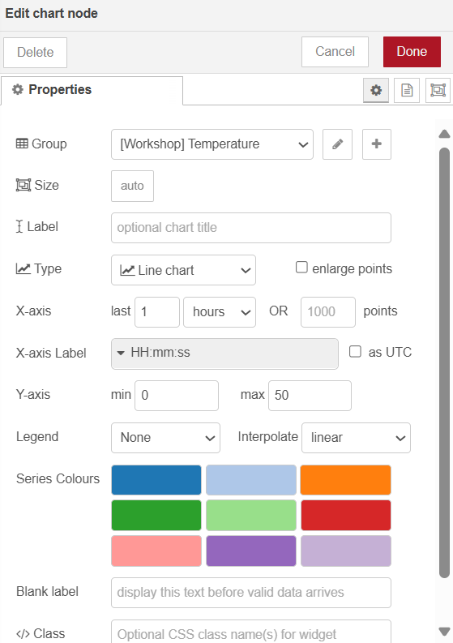


### 💧 4. Humidity Gauge

- **Widget**: `ui_gauge`
- **Group**: `[Workshop] Humidity`
- **Type**: `Level`
- **Units**: `%`
- **Range**: 0 to 100
- **Value format**: `{{msg.payload}}`

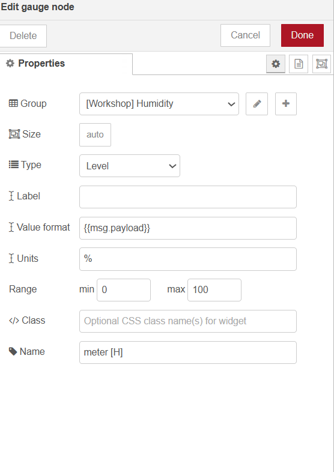


### 📉 5. Humidity Chart

- **Widget**: `ui_chart`
- **Group**: `[Workshop] Humidity`
- **Type**: `Line chart`
- **X-axis**: `last 1 hour`
- **Y-axis Range**: 0 to 100

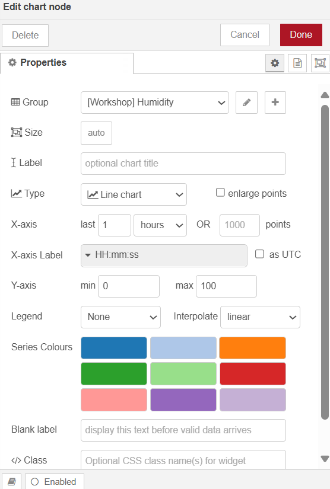


### 🧭 6. Dashboard Grouping Structure

To organize widgets visually, assign each widget to a **Group** under a **Tab** (e.g., `Workshop`). You can define:
- Group Width
- Display options (collapse, name visibility)

📌 Example configuration:

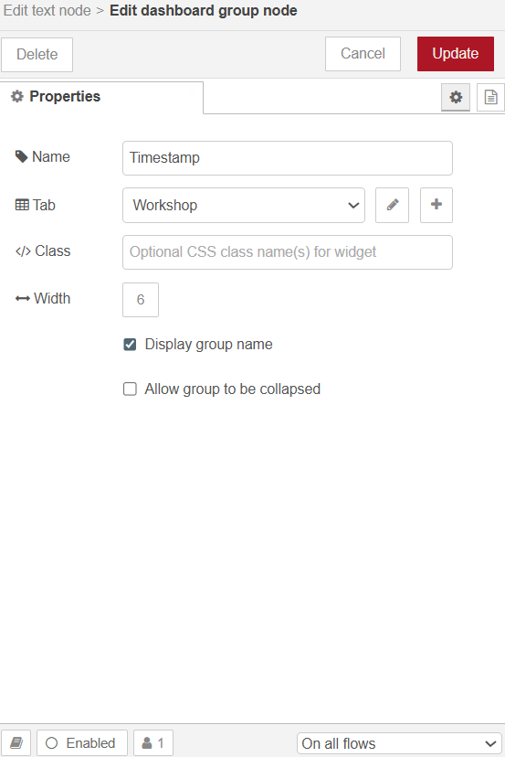


> ✅ After deploying the flow, open your Node-RED dashboard in a browser:
> ```
> http://localhost:1880/ui
> ```

This dashboard will now live-update with real-time sensor values streamed from the ESP32 via MQTT!
